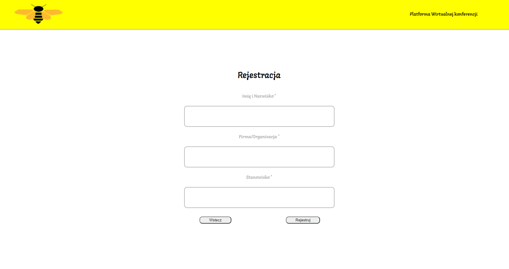
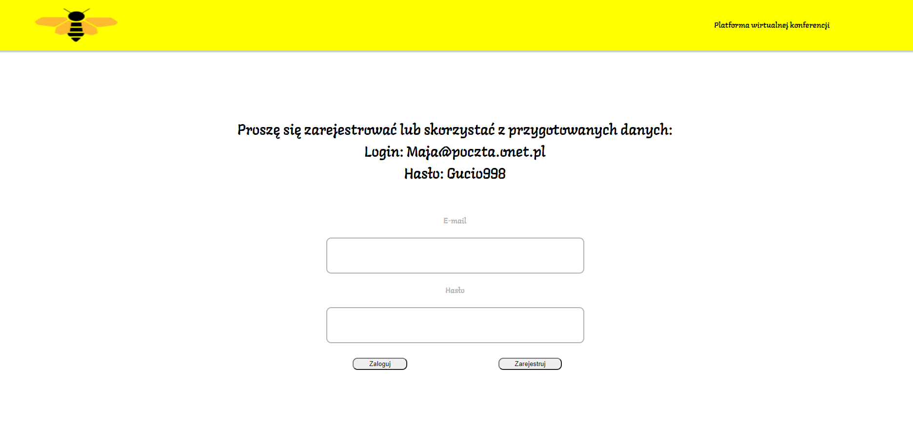
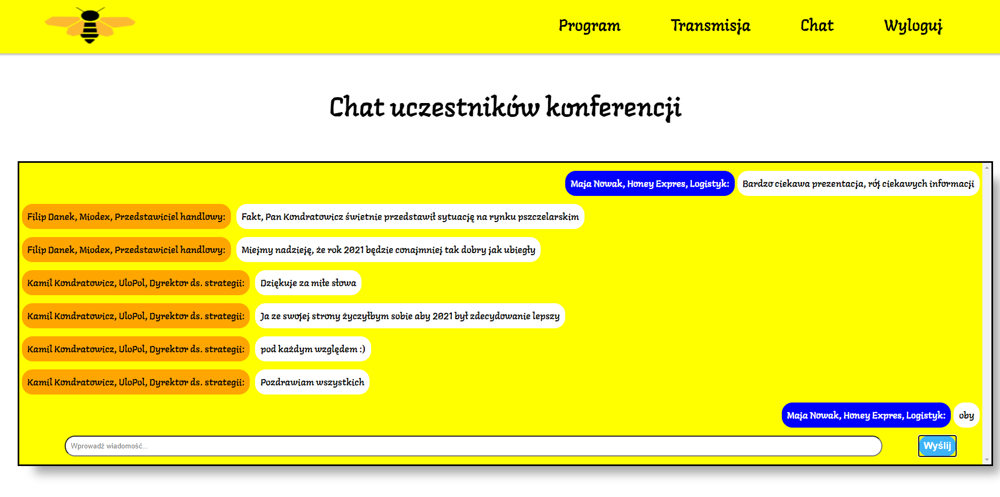
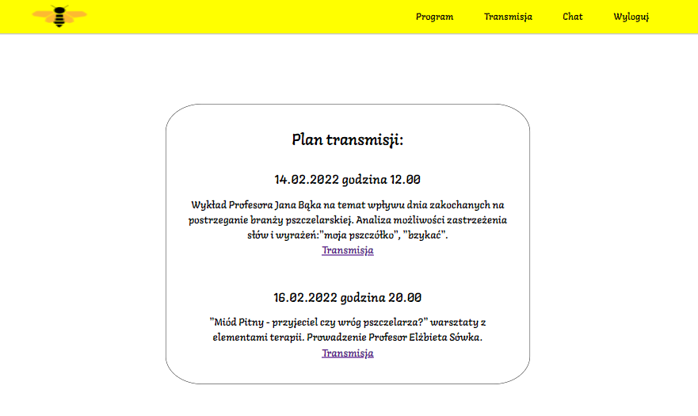
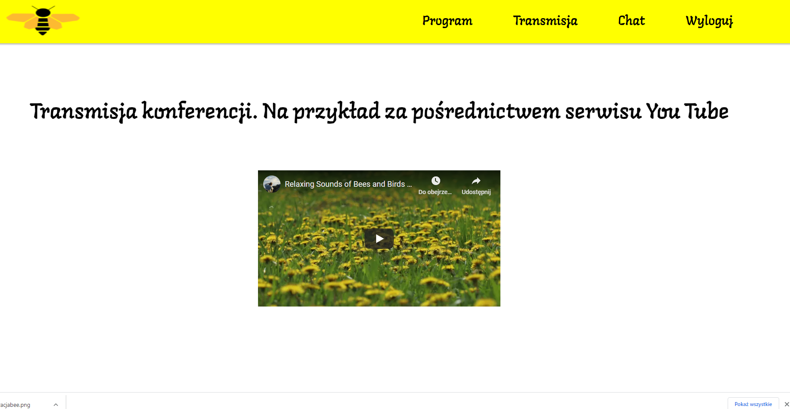

# Table of contents
* [General info](#general-info)
* [Technologies](#technologies)
* [Features](#Features)
* [Web adress](#web-adress)
## General info
This project is simple Virtual Conference Portal.
	
## Technologies
Project is created with:
* HTML5
* CSS3
* JavaScript
* Firebase
	
## Features
* Login and register

* Chat

* Agenda

* Web streaming

## Web adress
To run this project go to https://konferencjaopszczolkach.000webhostapp.com/
